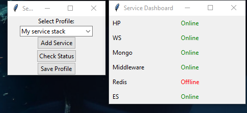

# Service Monitor App
Monitor any number of services to see that they are Online in a simple GUI



## Installation

1. Clone the repository:
   ```sh
   git clone https://github.com/skuggfiskar/Service-Monitor.git
   ```
2. Install the dependencies:
   ```sh
   pip install -r service_monitor/requirements.txt
   ```

## Running the App
   ```sh
   python service_monitor/app.py
   ```

## Running the App Without Console Window (Windows)
   Double-click on `launch_service_monitor.pyw`
